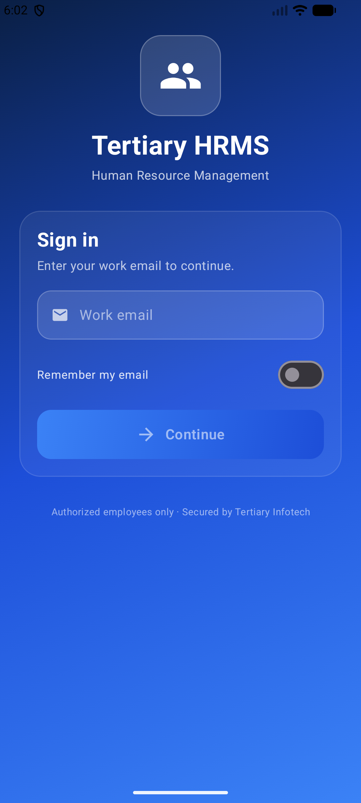

<div align="center">

# Tertiary HRMS — Android

[](https://play.google.com/store/apps/details?id=com.tertiaryinfotech.hrportal)
[](https://developer.android.com)
[](https://kotlinlang.org)
[](https://developer.android.com/jetpack/compose)
[](https://developer.android.com)
[](https://developer.android.com)

**Your HR on the go — leave, payslips, expenses, team and timesheet, rebuilt fully native.**

<a href="https://play.google.com/store/apps/details?id=com.tertiaryinfotech.hrportal">
  
</a>

[Download on Google Play](https://play.google.com/store/apps/details?id=com.tertiaryinfotech.hrportal) · [Web App](https://hrms.tertiaryinfotech.com) · [Report Bug](https://github.com/alfredang/hrmsapp_android/issues) · [Request Feature](https://github.com/alfredang/hrmsapp_android/issues)

</div>

## Screenshot

<div align="center">



</div>

## About

**Tertiary HRMS for Android** is the Google Play build of Tertiary Infotech Academy's Human
Resource Management System — **rebuilt fully native in Kotlin + Jetpack Compose**, with no WebView
and no cross-platform runtime. It is the Android sibling of the native iOS app and a faithful 1:1
port of its features, **Premier Blue** theme (navy → azure gradient, frosted cards), and API layer.

The app is a **secure client** of the existing HRMS web backend — it has no database of its own.
All data stays on the company server and is accessed over encrypted HTTPS, reusing the web app's
existing single sign-on session, exactly as a browser would.

### Features

| Module | Description |
|--------|-------------|
| **Login** | Email + password or one-time email code (OTP), via the web app's NextAuth session. **Persistent** — stays signed in across app restarts |
| **Dashboard** | Annual, medical and OT leave balances plus expenses at a glance; **Approvals queue** cards for admins (Manager / HR / Admin) |
| **Leave** | View balances and full request history, and apply for leave in a few taps (server computes working days and proration). **Medical leave (MC)** attaches an MC photo |
| **Approvals** *(admins only)* | Approve or reject pending leave and expense requests in-app — enforced server-side (role ∈ Manager / HR / Admin) |
| **Payslips** | Browse personal payslips and open the official PDF, rendered natively in-app via `PdfRenderer` |
| **Expenses** | Submit and track expense / medical claims with a receipt photo and clear status badges |
| **Team** | Search the company directory |
| **Calendar** | Public holidays, personal events and approved leave, grouped by month |
| **Timesheet** | Simple **clock in / out** with a live elapsed timer and a monthly daily check-in/out history with total hours |
| **Intern Attendance** (admin) | Each intern's days worked + total hours per month, drilling into their daily history |
| **Notifications** | In-app bell with unread badge and a notifications list |
| **Profile** | Full employee record, change password, and a **light / dark theme** toggle |

> **Secure by design** — for authorized Tertiary Infotech employees only. Sign in with email and
> password or a one-time email code; the session cookie is reused for every call over HTTPS. No
> advertising or analytics SDKs.

## Tech Stack

| Category | Technology |
|----------|------------|
| **Language** | Kotlin (JVM target 17) |
| **UI** | Jetpack Compose, Material Design 3 |
| **Architecture** | Single-activity MVVM, `AndroidViewModel` as single source of truth |
| **Navigation** | Navigation Compose |
| **Networking** | OkHttp 4 + `PersistentCookieJar` (SharedPreferences-backed) |
| **Serialization** | kotlinx.serialization (JSON) |
| **PDF** | Android `PdfRenderer` (native payslip viewer) |
| **Build** | Gradle 8.14.3 (wrapper), AGP 8.9+ |
| **Backend** | Next.js 14 + PostgreSQL on Coolify (`hrms.tertiaryinfotech.com`) — consumed read-only |

## Architecture

```
┌──────────────────────────────────────────────────────────────┐
│  MainActivity (single Activity, Jetpack Compose)               │
│  RootScreen → LoginScreen | MainScaffold (Home/Leave/Team/More)│
└───────────────────────────┬──────────────────────────────────┘
                            │  state
┌───────────────────────────▼──────────────────────────────────┐
│  AuthViewModel  (AndroidViewModel — single source of truth)    │
└───────────────┬───────────────────────────┬──────────────────┘
                │                           │
      ┌──────────▼─────────┐      ┌──────────▼──────────┐
      │  AuthService       │      │  HrmsApi            │
      │  NextAuth sign-in  │      │  typed reads +      │
      │  csrf→callback→    │      │  apply-leave +      │
      │  session           │      │  PDF download       │
      └──────────┬─────────┘      └──────────┬──────────┘
                │                           │
          ┌──────▼───────────────────────────▼──────┐
          │  One shared OkHttp client                │
          │  + PersistentCookieJar (cookie reuse)    │
          └──────────────────┬───────────────────────┘
                            │ HTTPS
          ┌──────────────────▼───────────────────────┐
          │  HRMS web backend (Next.js 14 + Postgres) │
          │  /api/auth/*  ·  /api/mobile/*  ·  /api/… │
          └───────────────────────────────────────────┘
```

## Project Structure

```
hrmsapp_android/
├── app/src/main/java/com/tertiaryinfotech/hrportal/
│   ├── MainActivity.kt              # Single activity host
│   ├── TertiaryHrmsApp.kt           # App entry / composition root
│   ├── data/
│   │   ├── AuthService.kt           # NextAuth sign-in flow
│   │   ├── HrmsApi.kt               # Typed reads + apply-leave + PDF
│   │   ├── Net.kt                   # BASE_URL + shared OkHttp client
│   │   ├── PersistentCookieJar.kt   # SharedPreferences-backed cookies
│   │   ├── Models.kt                # Serializable DTOs
│   │   └── FlexNumberSerializer.kt
│   └── ui/
│       ├── AuthViewModel.kt         # Single source of truth
│       ├── LoginScreen.kt
│       ├── RootScreen.kt
│       ├── screens/                 # Dashboard, Leave, Team, Payslips, …
│       ├── components/              # Reusable Premier Blue controls
│       └── theme/Theme.kt           # Premier Blue gradient theme
├── store/                           # Play listing assets + submission guide
├── scripts/                         # Asset generation helpers
└── app/build.gradle.kts
```

## Getting Started

### Prerequisites

- **JDK 17** (the one bundled with Android Studio works well)
- **Android SDK** with platform 36 installed
- An Android device or emulator running **Android 7 (API 24)** or newer

### Build & Run

No Android Studio GUI required — the project builds from the CLI.

```bash
export JAVA_HOME="/Applications/Android Studio.app/Contents/jbr/Contents/Home"
export ANDROID_HOME="$HOME/Library/Android/sdk"

# Debug build + install on a running emulator/device
./gradlew :app:assembleDebug
$ANDROID_HOME/platform-tools/adb install -r app/build/outputs/apk/debug/app-debug.apk
```

Changing the deployed backend URL means updating `Net.BASE_URL` in
[`data/Net.kt`](app/src/main/java/com/tertiaryinfotech/hrportal/data/Net.kt).

## Deployment (Google Play)

> **Live on Google Play** — [Tertiary HRMS](https://play.google.com/store/apps/details?id=com.tertiaryinfotech.hrportal) is published and available for download.

```bash
# Signed release artefacts (require keystore.properties + keystore/ — gitignored)
./gradlew :app:bundleRelease      # → app-release.aab  (Google Play)
./gradlew :app:assembleRelease    # → app-release.apk  (sideload)
```

- App id **`com.tertiaryinfotech.hrportal`** (matches the iOS bundle id).
- Play app signing is recommended; the local **upload key** lives in `keystore/upload-keystore.jks`
  with credentials in `keystore.properties` — **both gitignored. Back them up securely; the
  password is not recoverable.**
- Release signing only activates when `keystore.properties` is present, so CI/other machines build
  unsigned debug fine.
- Play listing assets and a step-by-step submission guide live in [`store/`](store/).

## Contributing

1. Fork the repository
2. Create a feature branch (`git checkout -b feature/amazing-feature`)
3. Commit your changes (`git commit -m 'Add amazing feature'`)
4. Push to the branch (`git push origin feature/amazing-feature`)
5. Open a Pull Request

When a feature changes on Android, **mirror it on the iOS app** to keep parity.

## Developed By

**Tertiary Infotech Academy Pte. Ltd.**
[hrms.tertiaryinfotech.com](https://hrms.tertiaryinfotech.com)

## Acknowledgements

- Built with [Jetpack Compose](https://developer.android.com/jetpack/compose) and
  [Material Design 3](https://m3.material.io)
- Networking by [OkHttp](https://square.github.io/okhttp/) and
  [kotlinx.serialization](https://github.com/Kotlin/kotlinx.serialization)
- Native sibling of the Tertiary HRMS iOS app

---

<div align="center">

If you find this project useful, please consider giving it a ⭐

</div>
